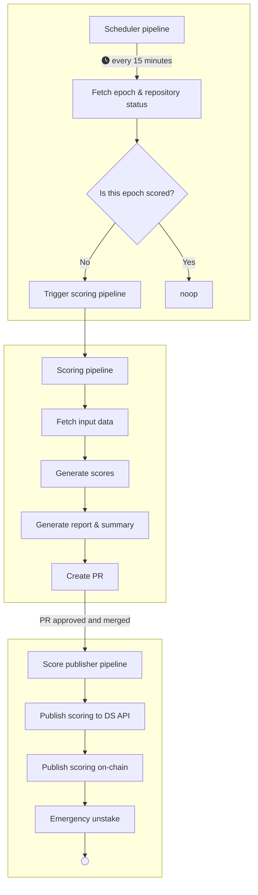

# Delegation Strategy Pipeline
This repository takes care of running Marinade's process scoring Solana validators.

## Scoring results
The directory `scoring` contains results of scoring runs along with reports.

## Pipelines

Several pipelines are defined here, see their flow in the graph attached below:

